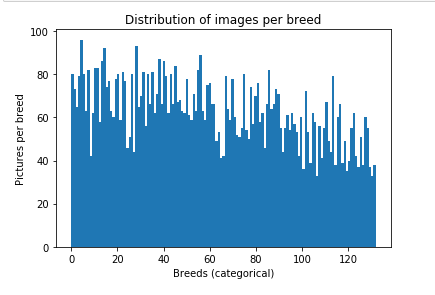

# Data Science Nanodegree Project: Dog Breed Classifier

# Project Definition

## Project Overview

The goal of this project is providing a web app to make dog breed classification as easy as uploading an image and pressing send. To archive this feat this project will employ CNNs (convolutional neural networks). Classifications will be based on established Computer Vision Models such as VGG16 and ResNet50.

## Problem Statement

Idetifiying dog breeds from images alone can be quite problematic. Some breeds look very alike and can be misjudged by unexperienced people. Computer Vision and CNNs for classification can aid in this process. CNNs can identify these small differences if trained apropriately. 

The solution should be able to automaticly identify a dog's breed by taking a photo of a dog and providing this photo to the trained CNN. This will be done in a web app, but could also be used in native apps or desktop apps.

If an image of a person is uploaded instead a judgemnt should be made which breed this person looks alike.

If no human or dog is identifyable in the image, no prediction will be made.

## Metrics

Models are scored on their accuracy of correctly identifying a breed. As identification of a breed is the only relavant outcome and is a binary decision accuracy is a good metric. Accuracy will be calculated based an amount of successful identifications in all predictions.

# Analysis

## Data Exploration

On first inspection our dataset of dogs with labeled breeds consists of 8351 images in 133 categories. All breeds are represented in the dataset. On average 63 images should be present per breed. 

On closer observation breeds are not represented equaly and some are represented with more than 90 images where others only have close to 40. This could lead to a bias in our model as some species are overrepresented.

Two breeds are represented by only 33 images: 107.Norfolk_terrier and 131.Wirehaired_pointing_griffon.

Three breeds are represented white over 90 images: 4.Akita , 28.Bluetick_coonhound and 14.Basenji.

Images contain varying background, angles and positions of dogs. This is beneficial as it prepares our model for user generated images which can not be controlled.

The images are not of uniform size and have to be resized in the data preparation step.

Names of breeds are identified by parsing the names of the training data. As each breed name starts with its corresponding categorical id breeds can be identified by name.

## Data Visualization

To support data exploration this histigram supports the previous statements and shows the distribution of all breeds in the dataset. Breeds are adressed by their categorical id, as names would have been overly long.



# Methodology

## Data Preparation

Data was pre-split into training, validation and testing data. As the provides images are of different sizes each image ist loaded as a 224 x 224 pixel version, making them uniform and fit for our CNNs.

As we can not input images directly we have to convert image data to an array with additional depth 3, as each pixel consists of RGB values. The resulting tensor has dimensionality (224,224,3) and describes each pixel.

As Keras needs a 4D tensor with the first value representing the number of samples, dimensionality is increasd by 1 with a default value of 1. A default value of 1 is chosen because only 1 image is persent in this tensor.

## Implementation

Creating an Architecture for a CNN from scratch was a challenge. Finding the best combination of layers resulted in many setbacks, but with multiple dropout layers to combat overfitting an acceptable accuracy was reached. Adding more layers has not always given better results, therefore only few layers were used.

The winning architecture for the from scratch model was:

```
_________________________________________________________________
Layer (type)                 Output Shape              Param #   
=================================================================
conv2d_50 (Conv2D)           (None, 224, 224, 16)      208       
_________________________________________________________________
max_pooling2d_36 (MaxPooling (None, 112, 112, 16)      0         
_________________________________________________________________
dropout_27 (Dropout)         (None, 112, 112, 16)      0         
_________________________________________________________________
conv2d_51 (Conv2D)           (None, 112, 112, 32)      2080      
_________________________________________________________________
max_pooling2d_37 (MaxPooling (None, 56, 56, 32)        0         
_________________________________________________________________
dropout_28 (Dropout)         (None, 56, 56, 32)        0         
_________________________________________________________________
conv2d_52 (Conv2D)           (None, 56, 56, 64)        8256      
_________________________________________________________________
max_pooling2d_38 (MaxPooling (None, 28, 28, 64)        0         
_________________________________________________________________
dropout_29 (Dropout)         (None, 28, 28, 64)        0         
_________________________________________________________________
flatten_13 (Flatten)         (None, 50176)             0         
_________________________________________________________________
dense_23 (Dense)             (None, 500)               25088500  
_________________________________________________________________
dropout_30 (Dropout)         (None, 500)               0         
_________________________________________________________________
dense_24 (Dense)             (None, 133)               66633     
=================================================================
Total params: 25,165,677
Trainable params: 25,165,677
Non-trainable params: 0
_________________________________________________________________
```

In this model multipe convolutionla, pooling and dropout layers are followed by a flatteing and droput layer before gathering the results in a 133 node dense layer, as we have 133 categories to predict.

## Refinement

The model was improved by adding additinal convolutional layers for better feature detection and dropout layers to combat overfitting.

This architecture was ultimately dropped as it was becoming to ressource intensive. Further improvements were made by using pretrained models and leveraging transfer learning.

A first attempt was made with VGG16. Importing predefined features helped improve accuracy to over 50% from unter 10% for my own model. 

The transfer learning model consists of import layer for the VGG16 Features and a dense layer to map these features onto dog breeds.

```
bottleneck_features = np.load('bottleneck_features/DogVGG16Data.npz')
train_VGG16 = bottleneck_features['train']
VGG16_model = Sequential()
VGG16_model.add(GlobalAveragePooling2D(input_shape=train_VGG16.shape[1:]))
VGG16_model.add(Dense(133, activation='softmax'))

VGG16_model.summary()
_________________________________________________________________
Layer (type)                 Output Shape              Param #   
=================================================================
global_average_pooling2d_1 ( (None, 512)               0         
_________________________________________________________________
dense_25 (Dense)             (None, 133)               68229     
=================================================================
Total params: 68,229
Trainable params: 68,229
Non-trainable params: 0
_________________________________________________________________

Test accuracy: 51.6746%
```

The solution was further refined by using transfer learing from an established CNN Resnet50 for excelent breed identification.

Transfer Learning from a pretrained Resnet50 model increased accuracy dramaticaly

The final solution consists of a feature extraction layer from Resnet50 and a dense layer for mapping these features onto the 133 breeds.

```
bottleneck_features = np.load('bottleneck_features/DogResnet50Data.npz')
train_Resnet50 = bottleneck_features['train']
Resnet50_model = Sequential()
Resnet50_model.add(GlobalAveragePooling2D(input_shape=train_Resnet50.shape[1:]))
Resnet50_model.add(Dense(133, activation='softmax'))

Resnet50_model.summary()
_________________________________________________________________
Layer (type)                 Output Shape              Param #   
=================================================================
global_average_pooling2d_3 ( (None, 2048)              0         
_________________________________________________________________
dense_27 (Dense)             (None, 133)               272517    
=================================================================
Total params: 272,517
Trainable params: 272,517
Non-trainable params: 0
_________________________________________________________________

Test accuracy: 81.6986%

```

This model scored a test accuracy of 81.6986% in identifying the correct breed.
 

# Results

## Model Evaluation and Validation

The final model uses pretrained features from an established CNN (ResNet50). Features are imported into the model and are mapped to 133 breeds.

Tests returned an accuracy of over 80%.

## Justification

Building a CNN from scratch can be quite demanding and not all architectures guarantee good accuracy. This project has started with building a small CNN from scracth with a accuracy of 8.9% when identifying breeds. Scaling this up to many more layers could have given better results but would be very ressource intensive. 

Rather than building our own model transfer learning from the estabslied ResNet50 was utilized to increase our accuracy to 81.7%. This has given an incredible boost while being very ressource friendly.

In the final step this trained model was transfered into a web app for conventient use by anyone. 

# Conclusion

Trying to build my own CNN seemed a good idea at first. But low accuracy and big time investment was very punishing. As image classification has already been explored by many other projects transfer learning seemed to be a good option. 

Overfitting and very slow learing rates we most problematic als changes in model arhictecture meant long training sessions. Changes were also not always guranteed to get better results and sometimes even stopped to improve error loss after a few epochs.

After trying VGG16 als a basis for the classification we moved on to ResNet50, wich gave better results. We could also have tried VGG19 or AlexNet, but the accuracy of over 80% seemed acceptable.

As the model was trained it had to be made accessable through the web app. A simple Flask app with a straight forward design and the sole focus on recognizing dog breeds was created. Transfering the model took little effort as it was saved in the training process.

Further improvements could be made to classification model by testing other architectures or investing more time into training and hyperparameter tuning.
An interesting improvement for the webapp could be expressing the top 3 most likely breeds oder showing a side by side view with a representational image of the identified breed.

# Further details

For further details in training and data exploration please see: [notebook](dog_app.ipynb) or [html version](dog_app.html)

# Web App

A web app is provided in the app directory.

The app consists of a cv_predictor that uses the pretrained model from the python notebook. Because the dog dataset is quite bit, I chose to include all dog categories as a list in dog_breeds.py for easy access.

### Required Dependencies

```
	tensorflow==2.5.0
	flask==2.0.1
	opencv-python==4.5.3.56
	keras==2.4.3
```

### Additional data before starting the App

Donwload the [Resnet50 bottleneck features](https://s3-us-west-1.amazonaws.com/udacity-aind/dog-project/DogResnet50Data.npz) for the dog dataset.  Place it in the repo, at location `path/to/project/bottleneck_features`.

### Running the App

Run the app by navigating to the app directory and execute 

```
cd app
python run.py
```

### Web App files

- `app.py` starts a flask app and provides routes for form submission and results
- `cv_predictor.py` uses the pretrained model to classify dog breeds. Humans and dogs are identified with ResNet and haarcascades.
- `dog_names.py` List of dog breeds as the original dogs dataset is not included
- `extract_bottleneck_features.py` utility for extracting features from different CNNs
- `run.py` starts the app
- `templates\identify.html` html markup providing a form and results